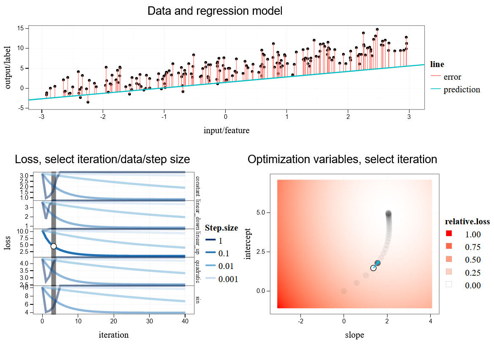

```{r opts, echo=FALSE}
knitr::opts_chunk$set(
  echo=FALSE, results=FALSE,
  dpi=200,
  fig.width=10,
  fig.height=6)
possible.conda <- c(
  "~/.local/share/r-miniconda",
  "~/miniconda3")
conda.dir <- normalizePath(possible.conda[dir.exists(possible.conda)][1])
env.name <- "2023-08-deep-learning"
python <- paste0(
  "python",
  if(.Platform$OS.type=="unix")"" else ".exe")
Sys.setenv(RETICULATE_PYTHON=paste0(
  conda.dir, "/envs/", env.name, "/bin/", python))
reticulate::use_condaenv(env.name, required=TRUE)
in_render <- !is.null(knitr::opts_knit$get('rmarkdown.pandoc.to'))
if(FALSE){
  setwd("slides")
  rmarkdown::render("09-regression.Rmd")
}
```

# Supervised machine learning

- Goal is to learn a function $f(\mathbf x)=y$ where $\mathbf
  x\in\mathbb R^p$ is an input/feature vector and $y$ is an
  output/label.
- This week we will study linear models and neural networks for
  regression, meaning labels represented by $y\in \mathbb R$ is a real
  number.
- forest fires data: $\mathbf x=$meteorological and other data, 
  $y\in\mathbb R_+$ burned area.
- air foil self-noise data: $\mathbf x=$ Frequency (Hertz), Angle of
  attack (degrees), Chord length (meters), Free-stream velocity
  (meters per second), $y\in\mathbb R$ Scaled sound pressure level, in
  decibels.
  
---

# air foil self-noise

```{python results=TRUE}
import plotnine as p9
p9.options.figure_size=(4.5,2.5)
import numpy as np
np.set_printoptions(linewidth=55)
import pandas as pd
import os
# grid/contouring functions
def make_grid(mat, n_grid = 80):
    nrow, ncol = mat.shape
    assert ncol == 2
    mesh_args = mat.apply(
        lambda x: np.linspace(min(x),max(x), n_grid), axis=0)
    mesh_tup = np.meshgrid(*[mesh_args[x] for x in mesh_args])
    mesh_vectors = [v.flatten() for v in mesh_tup]
    out_df = pd.DataFrame(dict(zip(mesh_args,mesh_vectors)))
    out_df.columns = mat.columns
    return out_df
# https://scikit-image.org/docs/dev/api/skimage.measure.html#skimage.measure.find_contours
# https://scikit-image.org/docs/dev/auto_examples/edges/plot_contours.html#sphx-glr-auto-examples-edges-plot-contours-py
def contour_paths(three_cols, level):
    from skimage import measure
    uniq_df = three_cols.iloc[:,:2].apply(pd.unique)
    n_grid = uniq_df.shape[0]
    fun_mat = three_cols.iloc[:,2].to_numpy().reshape(
        [n_grid,n_grid]).transpose()
    contours = measure.find_contours(fun_mat, level)
    contour_df_list = []
    half_df = (uniq_df-uniq_df.diff()/2)[1:]
    half_df.index = [x-0.5 for x in half_df.index]
    lookup_df = pd.concat([uniq_df, half_df])
    for contour_i, contour_mat in enumerate(contours):
        one_contour_df = pd.DataFrame(contour_mat)
        one_contour_df.columns = [c+"_i" for c in uniq_df]
        one_contour_df["contour_i"] = contour_i
        for cname in lookup_df:
            iname = cname+"_i"
            contour_col = one_contour_df[iname]
            lookup_col = lookup_df[cname]
            index_df = lookup_col[contour_col].reset_index()
            one_contour_df[cname] = index_df[cname]
        contour_df_list.append(one_contour_df)
    return pd.concat(contour_df_list)

# work-around for rendering plots under windows, which hangs within
# emacs python shell: instead write a PNG file and view in browser.
import webbrowser
on_windows = os.name == "nt"
in_render = r.in_render if 'r' in dir() else False
using_agg = on_windows and not in_render
if using_agg:
    import matplotlib
    matplotlib.use("agg")
def show(g):
    if not using_agg:
        return g
    g.save("tmp.png")
    webbrowser.open('tmp.png')

data_info_dict = {
    "forest_fires":("../data/forestfires.csv",","),
    "air_foil":("../data/airfoil_self_noise.tsv","\t"),
}
def norm01(label_vec):
    lmin = label_vec.min()
    return (label_vec-lmin)/(label_vec.max()-lmin)
data_dict = {}
hist_df_list = []
for data_name,(file_name,sep) in data_info_dict.items():
    data_df = pd.read_csv(file_name,sep=sep,header=0)
    data_nrow, data_ncol = data_df.shape
    label_col_num = data_ncol-1
    data_label_vec = data_df.iloc[:,label_col_num]
    def append(transform, label_vec):
        hist_df_list.append(pd.DataFrame({
            "data_name":data_name,
            "transform":transform,
            "label":label_vec,
            "label_name":data_df.columns[label_col_num]
        }))
    append("none",data_label_vec)
    append("norm01",norm01(data_label_vec))
    log_label_vec = np.log(data_label_vec-data_label_vec.min()+1)
    append("log",log_label_vec)
    append("log,norm01",norm01(log_label_vec))
    is_feature_col = (
        np.arange(data_ncol) != label_col_num
    ) & (
        data_df.dtypes != "object"
    )
    data_features = data_df.loc[:,is_feature_col]
    feature_nrow, feature_ncol= data_features.shape
    feature_mean = data_features.mean().to_numpy().reshape(1,feature_ncol)
    feature_std = data_features.std().to_numpy().reshape(1,feature_ncol)
    feature_scaled = (data_features-feature_mean)/feature_std
    print("%s %s"%(data_name, data_features.shape))
hist_df = pd.concat(hist_df_list)
#p9.theme(text=p9.element_text(size=30))+\
some_hist_df = hist_df.query('data_name=="air_foil" & transform=="none"')
first=some_hist_df.iloc[0,:]
ylab="transform=%s(%s)"%(first["transform"],first["label_name"])
gg_hist = p9.ggplot()+\
    p9.geom_histogram(
        p9.aes(
            x="label"
        ),
        data=some_hist_df)+\
    p9.xlab("transform=%s(%s)"%(
        first["transform"],first["label_name"]))
gg_hist

TODO angle to sin/cos

TODO plot loss fun
```

---

# Visualize predictions of 1-nearest neighbor algorithm

```{python}
mix_features, mix_labels = data_dict["mixture"]
grid_df = make_grid(mix_features)
#https://stackoverflow.com/questions/55496700/starred-expression-inside-square-brackets does not work?
#np.ogrid[-1:1:5j, -2:3:0.5]
#slice_vec = feature_mat.apply(lambda x: slice(min(x),max(x), complex(imag=n_grid)), axis=0)
grid_mat = grid_df.to_numpy()
neigh = KNeighborsClassifier(n_neighbors=1).fit(mix_features, mix_labels)
grid_df["prediction"] = neigh.predict(grid_mat)
grid_df["party"] = number_to_party_vec(grid_df.prediction)
gg = p9.ggplot()+\
    p9.theme_bw()+\
    p9.theme(subplots_adjust={'right': 0.7, 'bottom':0.2})+\
    p9.geom_point(
        p9.aes(
            x="height_in",
            y="weight_lb",
            color="party"
        ),
        size=0.1,
        data=grid_df)+\
    p9.geom_point(
        p9.aes(
            x="height_in",
            y="weight_lb",
            fill="party"
        ),
        color="black",
        size=2,
        data=mixture_df)+\
    p9.scale_color_manual(
        values=party_colors)+\
    p9.scale_fill_manual(
        values=party_colors)
show(gg)

```

---

# Visualize predictions of 100-nearest neighbor algorithm

```{python}
neigh = KNeighborsClassifier(
    n_neighbors=100
).fit(mix_features, mix_labels)
grid_df["prediction"] = neigh.predict(grid_mat)
grid_df["party"] = number_to_party_vec(grid_df.prediction)
gg = p9.ggplot()+\
    p9.theme_bw()+\
    p9.theme(subplots_adjust={'right': 0.7, 'bottom':0.2})+\
    p9.geom_point(
        p9.aes(
            x="height_in",
            y="weight_lb",
            color="party"
        ),
        size=0.1,
        data=grid_df)+\
    p9.geom_point(
        p9.aes(
            x="height_in",
            y="weight_lb",
            fill="party"
        ),
        color="black",
        size=2,
        data=mixture_df)+\
    p9.scale_color_manual(
        values=party_colors)+\
    p9.scale_fill_manual(
        values=party_colors)
show(gg)

```

---

# Linear model predictions

```{python}
from sklearn.linear_model import LogisticRegression
lr = LogisticRegression().fit(mix_features, mix_labels)
grid_df["prediction"] = lr.predict(grid_mat)
grid_df["party"] = number_to_party_vec(grid_df.prediction)
gg = p9.ggplot()+\
    p9.theme_bw()+\
    p9.theme(subplots_adjust={'right': 0.7, 'bottom':0.2})+\
    p9.geom_point(
        p9.aes(
            x="height_in",
            y="weight_lb",
            color="party"
        ),
        size=0.1,
        data=grid_df)+\
    p9.geom_point(
        p9.aes(
            x="height_in",
            y="weight_lb",
            fill="party"
        ),
        color="black",
        size=2,
        data=mixture_df)+\
    p9.scale_color_manual(
        values=party_colors)+\
    p9.scale_fill_manual(
        values=party_colors)
show(gg)

```

---

# What is a linear model?

- Compute a real-valued score that measures how likely the feature
  vector is to be in the positive class. (predict positive class if
  score greater than zero)
- Parameters required in order to compute score must be learned from
  the train data: weights $\mathbf w\in\mathbb R^p$ and intercept
  $\beta\in\mathbb R$
  (sometimes called regression coefficients in the statistics
  literature).
- The score is computed by multiplying each feature with a weight,
  then adding them to the intercept: $f(\mathbf x)=\beta+\mathbf w^T \mathbf x$.
  Pseudo-code:
  
```python
def predict_score(feature_vec, weight_vec, intercept):
  score = intercept
  for weight, feature in zip(weight_vec, feature_vec):
    score += weight * feature
  return score
```

---

# Using learned coefficients to compute predictions

```{python echo=TRUE, results=TRUE}
from sklearn.linear_model import LogisticRegression
lr = LogisticRegression().fit(mix_features, mix_labels)
lr.intercept_
lr.coef_
g_df = pd.DataFrame(grid_mat, columns=["height_in","weight_lb"])
lr.decision_function(g_df)
(grid_mat * lr.coef_).sum(axis=1) + lr.intercept_
```

--- 

# Using learned coefficients to compute predictions 2

Vector of predictions for matrix of data is $\mathbf X \mathbf w$,

```{python echo=TRUE, results=TRUE}
lr.decision_function(g_df)
np.matmul(grid_mat, lr.coef_.T) + lr.intercept_
np.matmul(lr.coef_, grid_mat.T) + lr.intercept_
```

--- 

# Equations for plotting the decision boundary

- The linear model decision boundary is defined by $f(\mathbf x)=
  \beta + \mathbf w^T \mathbf x = 0$.
- On one side of this line we predict positive, and on the other side
  we predict negative.
- For the mixture data set ($p=2$) this implies $\beta + w_1 x_1 + w_2
  x_2 = 0$, and $x_2 = -(\beta+w_1 x_1)/w_2 = -\beta/w_2 - (w_1/w_2) x_1$.

```{python echo=TRUE, results=TRUE}
line_param_df = pd.DataFrame({
    "slope":-lr.coef_[:,0]/lr.coef_[:,1],
    "intercept":-lr.intercept_/lr.coef_[:,1]})
line_param_df
```

---

# Plotting the decision boundary with data and predictions

```{python}
gg_abline = gg+p9.geom_abline(
    p9.aes(
        slope="slope",
        intercept="intercept",
    ),
    size=2,
    data=line_param_df)
show(gg_abline)
```

---

# How are the coefficients learned?

- Typically we use some version of gradient descent.
- This algorithm requires definition of a differentiable loss function
  to minimize on the train set.
- For regression problems ($y\in\mathbb R$) we use the square loss,
  $\ell(\beta + \mathbf w^T \mathbf x, y) = (\beta + \mathbf w^T \mathbf x-y)^2$.
  
```{python}
pred_lim = 5
pred_grid = np.linspace(-pred_lim, pred_lim)
fun_dict = {
    "logistic":lambda f, y: np.log(1+np.exp(-y*f)),
    "square":lambda f, y: (y-f)**2,
}
def gg_loss(fun_name):
    fun = fun_dict[fun_name]
    loss_df = pd.concat([
        pd.DataFrame({
            "loss":fun(pred_grid, y),
            "predicted_score":pred_grid,
            "label":y,
        }) for y in (-1,1)])
    gg = p9.ggplot()+\
        p9.facet_grid(". ~ label", labeller="label_both")+\
        p9.theme_bw()+\
        p9.theme(subplots_adjust={'right': 1, 'bottom':0.2})+\
        p9.theme(figure_size=(4.5,2))+\
        p9.geom_line(
            p9.aes(
                x="predicted_score",
                y="loss",
                ),
            data=loss_df)+\
        p9.scale_x_continuous(breaks=range(-pred_lim, pred_lim+1))
    return gg
show(gg_loss("square"))
```

---

# Logistic regression and loss function

- For binary classification problems ($y\in\{-1,1\}$) we use the logistic
  loss, resulting in a model called logistic regression.
- Confusing name because it is actually for binary classification
  problems, not regression problems!
- Logistic loss is $\ell(\beta + \mathbf w^T \mathbf x, y) =
  \log[1+\exp(- y(\beta + \mathbf w^T \mathbf x))]$.
  
```{python}
show(gg_loss("logistic"))

```
  
---

# Optimization Problem and Gradients
  
For any set of coefficients $\mathbf w,\beta$ we define the loss
on the set of $n$ train examples as:

$$ \mathcal L(\mathbf w,\beta)=\sum_{i=1}^n \ell(\beta + \mathbf w^T
\mathbf x_i, y_i) $$

- We want to compute coefficients $\mathbf w,\beta$ which minimize the
  train loss $\mathcal L(\mathbf w,\beta)$ --- this is an optimization problem.
- Actually we would like to minimize the test loss, but we do not have
  access to the test set at train time, so we must assume that the train set
  is similar enough to be used as a surrogate.
- To minimize $\mathcal L$ we need to compute the gradients of the
  loss with respect to the optimization variables,
- $\nabla_\beta \mathcal L:\mathbb R^{p+1}\rightarrow\mathbb R$ tells
  us how $\beta$ is changing at the input coefficients, $\nabla_\beta
  \mathcal L(\mathbf w, \beta) = \partial \mathcal L(\mathbf w, \beta)/\partial \beta$.
- $\nabla_{\mathbf w} \mathcal L:\mathbb R^{p+1}\rightarrow\mathbb
  R^p$ tells us how $\mathbf w$ is changing at the input coefficients,
  $\nabla_{\mathbf w} \mathcal L(\mathbf w, \beta) = [\partial
  \mathcal L(\mathbf w,
  \beta)/\partial w_1 \cdots \partial \mathcal L(\mathbf w,
  \beta)/\partial w_p]$.
  
---

# Brief review of some facts from calculus

- Why do we need to do calculus? Because we need to compute partial
  derivatives / gradients to implement our learning algorithm!
- $d/dx\ y = dy/dx$ is the derivative of $y$ with respect to $x$.
- Constant: $d/dx\ a = 0$. 
- Polynomial: $d/dx\  x^a = a x^{a-1}$. (including linear, $a=1$)
- Logarithm: $d/dx \log x = 1/x$.
- Exponential: $d/dx \exp x = \exp x$.
- Linearity: $d/dx [g(x) + h(x)] = d/dx\ g(x) + d/dx\ h(x)$.
- Multiplicative constants: $d/dx [ cf(x) ] = c [ d/dx\ f(x) ]$.
- Chain rule: if $z = g(x)$ and $y = h(g(x)) = h(z)$ then we have

$$ \frac{dy}{dx} = \frac{dy}{dz} \frac{dz}{dx} = h'(z) g'(x) =
h'(g(x)) g'(x). $$

---

# Computation graph and chain rule for gradient

- Let $\hat y_i= \beta+ \mathbf w^T \mathbf x_i$ be the predicted
  score for example $i$.
- Then loss for example $i$ is $L_i = \ell(\beta+\mathbf w^T \mathbf
  x_i, y_i) = \ell(\hat y_i, y_i)$.

```{=latex}
  \begin{tikzpicture}[->,>=latex,shorten >=1pt,auto,node distance=2.1cm,
      thick,main node/.style={circle,draw}]
    \node[main node] (x) {$\mathbf x_i$};
    \node[main node] (w) [below of=x] {$\mathbf w$};
    \node[main node] (yhat) [right of=x] {$\hat y_i$};
    \node[main node] (beta) [below of=yhat] {$\beta$};
    \node[main node] (y) [right of=beta] {$y_i$};
    \node[main node] (L) [right of=yhat] {$L_i$};
    \path[every node/.style={font=\sffamily\small}]
    (x) edge (yhat)
    (w) edge (yhat)
    (beta) edge (yhat)
    (yhat) edge (L)
    (y) edge (L)
    ;
  \end{tikzpicture}
```

$$ \nabla \mathcal L(\mathbf w,\beta)=\sum_{i=1}^n \nabla \ell(\beta +
\mathbf w^T \mathbf x_i, y_i) = \sum_{i=1}^n \nabla L_i. $$

- This can simplify the gradient computation using the chain rule:

$$\nabla_\beta L_i = \frac{\partial L_i}{\partial \beta} =
\frac{\partial L_i}{\partial \hat y_i}
\frac{\partial \hat y_i}{\partial \beta} =
\frac{\partial L_i}{\partial \hat y_i},\ 
\nabla_{\mathbf w} L_i = 
\frac{\partial L_i}{\partial \hat y_i}
\nabla_{\mathbf w} \hat y_i =
\frac{\partial L_i}{\partial \hat y_i}
\mathbf x_i.
$$

---

# Gradient computation and chain rule for loss

- Need to compute $\partial L_i/\partial \hat y_i$.
- Logistic loss is $L_i = \ell(\hat y_i, y_i) = \log[1+\exp(- y_i\hat y_i)]$.
- Let $z_i = 1+\exp(- y_i\hat y_i)$, then $L_i = \log[z_i]$.
- Let $c_i = -y_i \hat y_i$, then $z_i = 1+\exp(c_i)$.

```{=latex}
  \begin{tikzpicture}[->,>=latex,shorten >=1pt,auto,node distance=2.1cm,
      thick,main node/.style={circle,draw}]
    \node[main node] (yhat) {$\hat y_i$};
    \node[main node] (y) [below of=yhat] {$y_i$};
    \node[main node] (c) [right of=yhat] {$c_i$};
    \node[main node] (z) [right of=c] {$z_i$};
    \node[main node] (L) [right of=z] {$L_i$};
    \path[every node/.style={font=\sffamily\small}]
    (yhat) edge (c)
    (y) edge (c)
    (c) edge (z)
    (z) edge (L)
    ;
  \end{tikzpicture}
```

We can also compute this gradient using the chain rule:

$$\frac{\partial L_i}{\partial \hat y_i} = 
\frac{\partial L_i}{\partial z_i} 
\frac{\partial z_i}{\partial c_i}
\frac{\partial c_i}{\partial \hat y_i} = 
\big(\frac{1}{z_i}\big)
\big(\exp[c_i]\big)
\big(-y_i\big) =
\frac{-y_i\exp(c_i)}{1+\exp(c_i)} =
\frac{-y_i}{1+\exp(y_i\hat y_i)}.$$

---

# Visualization of square loss gradient/derivative

```{python}
def log_deriv(pred, label):
    return -label / (1+np.exp(pred*label))
deriv_dict = {
    "logistic":log_deriv,
    "square":lambda f, y: 2*(f-y),
}
def gg_deriv(fun_name):
    deriv = deriv_dict[fun_name]
    loss_df = pd.concat([
        pd.DataFrame({
            "derivative":deriv(pred_grid, y),
            "predicted_score":pred_grid,
            "label":y,
        }) for y in (-1,1)])
    hline_dt = pd.DataFrame({"derivative":0},index=[0])
    gg = p9.ggplot()+\
        p9.facet_grid(". ~ label", labeller="label_both")+\
        p9.theme_bw()+\
        p9.theme(subplots_adjust={'right': 1, 'bottom':0.2})+\
        p9.theme(figure_size=(4.5,2))+\
        p9.geom_hline(
            p9.aes(
                yintercept="derivative",
            ),
            color="grey",
            data=hline_dt)+\
        p9.geom_line(
            p9.aes(
                x="predicted_score",
                y="derivative",
                ),
            size=1,
            data=loss_df)+\
        p9.scale_x_continuous(breaks=range(-pred_lim, pred_lim+1))
    return gg
show(gg_deriv("square"))

```

---

# Visualization of logistic loss gradient/derivative

```{python}
show(gg_deriv("logistic"))

```

---

# Gradient descent algorithm

- Start with random initial coefficients $\mathbf w^0, \beta^0$ near zero.
- Compute the gradient, which is the direction of steepest ascent.
- For each iteration $k\in\{0, 1,\dots\}$, take a step of size
  $\alpha>0$ in the opposite direction: (because we want to minimize
  the loss)
- Step size $\alpha$ is sometimes called learning rate, and can be
  either constant or variable $\alpha^k$ with each iteration $k$.
- $\mathbf w^{k+1} = {\mathbf w}^k - \alpha \nabla_{\mathbf w} \mathcal L(\mathbf w^k, \beta^k)$
- $\beta^{k+1} = \beta^k - \alpha \nabla_\beta \mathcal L(\mathbf w^k, \beta^k)$
- Optimizing a linear model with a convex loss function is a convex
  optimization problem, so a solution $\mathbf w^*,\beta^*$ which
  achieves the global minimum of the train loss $\mathcal L$ can be
  computed using gradient descent (if step size small enough).
- But do we want to minimize the train loss? (no, we want to minimize the test loss)

---

# Iterations of gradient descent

```{python}
feature_mat = mix_features.to_numpy()
mean_vec = feature_mat.mean(axis=0)
sd_vec = np.sqrt(feature_mat.var(axis=0))
scaled_mat = (feature_mat - mean_vec)/sd_vec
n_train = mix_labels.size
learn_mat = np.column_stack((np.repeat(1, n_train), scaled_mat))
label_vec = np.where(mix_labels==1, 1, -1)
max_iterations = 100
weight_vec = np.repeat(0.0, feature_mat.shape[1]+1)
step_size = 10
sk_pred = lr.decision_function(feature_mat)
sk_loss = fun_dict["logistic"](sk_pred, label_vec).mean()
loss_df_list = []
for iteration in range(max_iterations):
    pred_vec = np.matmul(learn_mat, weight_vec)
    deriv_loss_pred = deriv_dict["logistic"](pred_vec, label_vec)
    deriv_mat = deriv_loss_pred.reshape(n_train,1) * learn_mat
    grad_vec = deriv_mat.mean(axis=0)
    weight_vec -= step_size * grad_vec
    loss_vec = fun_dict["logistic"](pred_vec, label_vec)
    print('iteration=%d loss=%f gsum=%f'%(iteration,loss_vec.mean(),np.abs(grad_vec).sum()))
    orig_weights = weight_vec[1:]/sd_vec
    orig_intercept = weight_vec[0]-(mean_vec/sd_vec*weight_vec[1:]).sum()
    loss_df_list.append(pd.DataFrame({
        "iteration":iteration,
        "slope":-orig_weights[0]/orig_weights[1],
        "intercept":-orig_intercept/orig_weights[1],
        "loss":loss_vec.mean(),
    }, index=[0]))
    #np.matmul(feature_mat, orig_weights)+orig_intercept
    #np.matmul(learn_mat, weight_vec)
loss_df = pd.concat(loss_df_list)

def show_it(it):
    it_df = loss_df.query('iteration==%d'%it)
    gg_it = gg_abline+\
        p9.ggtitle("iteration=%d loss=%f sklearn=%f"%(it,it_df.loss, sk_loss))+\
        p9.geom_abline(
            p9.aes(
                slope="slope",
                intercept="intercept"
            ),
            color="deepskyblue",
            size=1,
            data=it_df)
    return gg_it
show(show_it(0))
```

---

# Iterations of gradient descent

```{python}
show(show_it(1))
```

---

# Iterations of gradient descent

```{python}
show(show_it(2))
```

---

# Iterations of gradient descent

```{python}
show(show_it(3))
```

---

# Iterations of gradient descent

```{python}
show(show_it(4))
```

---

# Iterations of gradient descent

```{python}
show(show_it(5))
```

---

# Iterations of gradient descent

```{python}
show(show_it(6))
```

---

# Iterations of gradient descent

```{python}
show(show_it(7))
```

---

# Iterations of gradient descent

```{python}
show(show_it(8))
```

---

# Iterations of gradient descent

```{python}
show(show_it(9))
```

---

# Iterations of gradient descent

```{python}
show(show_it(10))
```

---

# Iterations of gradient descent

```{python}
show(show_it(20))
```

---

# Iterations of gradient descent

```{python}
show(show_it(40))
```

---

# Iterations of gradient descent

```{python}
show(show_it(80))
```

---

# Interactive visualization of gradient descent for regression

http://ml.nau.edu/viz/2022-02-02-gradient-descent-regression/

{width=100%}

- Step size too large: subtrain loss increases (but should always
  decrease).
- Step size too small: learning is very slow (requires a lot of
  iterations to minimize loss).

---

# Early stopping regularization

- Goal is to have good predictions on held-out data (test set).
- Computing parameters which achieve global minimum of train loss may
  not be desirable (overfitting noise features in the train set, not
  relevant in the test data).
- So then how many iterations of gradient descent should we do?
- We need to split the train set into subtrain and validation sets in
  order to avoid overfitting.
- Subtrain set used to compute gradients and learn model **parameters**
  ($\beta,\mathbf w$).
- Validation set used to learn **hyper-parameter**, number of iterations
  $k$. The best one minimizes error/loss (maximizes accuracy) with respect
  to validation set.
- Plot subtrain and validation loss as a function of iteration $k$:
  subtrain always decreasing, and validation U shape.
  
---

# Add 20 noise features using np.random.randn

```{python results=TRUE}
mixture_noise = mixture_df.copy()
nrow, col = mixture_noise.shape
feature_names = ["height_in","weight_lb"]
for n_noise in range(20):
    np.random.seed(n_noise)
    fname = f"noise{n_noise}"
    feature_names.append(fname)
    mixture_noise[fname] = np.random.randn(nrow)*100
pd.set_option("display.max_columns", 4)
mixture_noise

```

---

# Demonstration of early stopping regularization

- Mixture data: 2 signal features, 20 noise features, gradient descent
  with constant step size $\alpha=1$.

```{python}
mixture_noise["set"] = np.resize(["subtrain","validation"], n_train)
is_subtrain = mixture_noise.set == "subtrain"
input_features = mixture_noise.loc[:,feature_names].to_numpy()
subtrain_features = input_features[is_subtrain,:]
subtrain_labels = label_vec[is_subtrain]
n_subtrain=subtrain_labels.size
mean_vec = subtrain_features.mean(axis=0)
sd_vec = np.sqrt(subtrain_features.var(axis=0))
scaled_mat = (subtrain_features - mean_vec)/sd_vec
learn_mat = np.column_stack((np.repeat(1, n_subtrain), scaled_mat))
max_iterations = 100
scaled_nrow, scaled_ncol = scaled_mat.shape
weight_vec = np.repeat(0.0, scaled_ncol+1)
step_size = 1
loss_df_list = []
for iteration in range(max_iterations):
    subtrain_pred = np.matmul(learn_mat, weight_vec)
    deriv_loss_pred = deriv_dict["logistic"](subtrain_pred, subtrain_labels)
    deriv_mat = deriv_loss_pred.reshape(n_subtrain,1) * learn_mat
    grad_vec = deriv_mat.mean(axis=0)
    weight_vec -= step_size * grad_vec
    orig_weights = weight_vec[1:]/sd_vec
    orig_intercept = weight_vec[0]-(mean_vec/sd_vec*weight_vec[1:]).sum()
    input_pred = np.matmul(input_features, orig_weights) + orig_intercept
    loss_vec = fun_dict["logistic"](input_pred, label_vec)
    iteration_set_loss = pd.DataFrame({
        "mean_loss":loss_vec,
        "set":mixture_noise.set,
    }).groupby("set").mean().reset_index()
    iteration_set_loss["iteration"] = iteration
    print(iteration_set_loss)
    loss_df_list.append(iteration_set_loss)
loss_df = pd.concat(loss_df_list)

valid = loss_df.query("set=='validation'")
min_valid = valid.iloc[[valid.mean_loss.argmin()]]
min_valid["label"] = "min at %d iterations"%min_valid.iteration
gg=p9.ggplot()+\
    p9.theme(subplots_adjust={'right': 0.7, "bottom":0.2})+\
    p9.geom_line(
        p9.aes(
            x="iteration",
            y="mean_loss",
            color="set"
            ),
        data=loss_df)+\
    p9.geom_point(
        p9.aes(
            x="iteration",
            y="mean_loss",
            color="set"
            ),
        data=min_valid)+\
    p9.geom_text(
        p9.aes(
            x="iteration",
            y="mean_loss",
            color="set",
            label="label"
            ),
        ha="left",
        va="top",
        data=min_valid)
show(gg)
```

---

# Commentary on regularization hyper-parameters

- The linear model learning algorithm is gradient descent, which
  computes the weight/intercept **parameters** (can be used to compute
  predictions).
- In every machine learning algorithm, we also need to learn one or
  more **hyper-parameters** which control regularization (and must be
  fixed prior to running the learning algorithm).
- In the linear model, we can use early stopping regularization,
  meaning the number of iterations is the **hyper-parameter** which
  needs to be learned using subtrain/validation splits.
- In the mixture data the mean loss with respect to validation set is
  minimized after only 5 iterations of gradient descent.
- Before 5 iterations we say the model **underfits**, since it is
  neither accurate on the subtrain nor on the validation data.
- After 5 iterations we say the model **overfits**, since it is memorizing
  the noise in the subtrain set which is not relevant for accurate
  prediction in the validation set.
- The optimal hyper-parameter values are specific to each data set
  (you always need to do a subtrain/validation split).

---

# Implementation details / scaling

Before learning make sure to 

- scale the input/feature matrix columns to each have mean=0 and sd=1.
- remove columns which are constant (sd=0).
- to learn intercept, can add a column of ones, and add an extra entry
  to weight vector (simpler to code).

If you do scaling as a part of your learning algorithm, then make sure
to report the coefficients on the original scale. (easier for user)

- Let $m_j,s_j$ be the mean/sd of each column $j$.
- Let $\tilde {\mathbf{ w}},\tilde\beta$ be the parameters learned using
  the scaled inputs.
- If $S^{-1}=\text{Diag}(1/s_1,\dots,1/s_p)$ then predictions are
$f(\tilde{\mathbf x})=
\tilde{\mathbf w}^T\tilde{\mathbf x} +\tilde{\beta} =
\tilde{\mathbf w}^T S^{-1} (\mathbf x-\mathbf m)+\tilde{\beta}$.
- Then the parameters for unscaled inputs are $w_j=\tilde w_j/s_j$ for
  all features $j$ with positive variance, and $\beta=\tilde \beta -
  \sum_{j=1}^p \tilde w_j m_j/s_j$.

---

# Where does the loss function come from?

- We assume that the labels are generated from a probability
  distribution, then compute model parameters which maximize the log
  likelihood.
- For regression problems maximizing the normal log likelihood results
  in minimizing the square loss: $y_i \sim N(\beta+\mathbf w^T \mathbf
  x_i,\sigma^2)$.

$$ \max_{\beta,\mathbf w} \sum_{i=1}^n
0.5\log(2\pi\sigma^2) - (\beta+\mathbf w^T \mathbf x_i-y_i)^2/(2\sigma^2).$$

- For binary classification problems maximizing the Bernoulli log
  likelihood results in minimizing the logistic loss: $y_i \sim
  \text{Bernoulli}[s(\beta+\mathbf w^T \mathbf x_i)]$, with the logistic
  link function: $s(\hat y_i) = 1/(1+\exp(-\hat y_i))$ is probability
  of class 1.

$$ \max_{\beta,\mathbf w} \sum_{i=1}^n
\log[s(\beta+\mathbf w^T \mathbf x_i)]I[y_i=1] +
\log[1-s(\beta+\mathbf w^T\mathbf x_i)]I[y_i=-1].
$$

---

# Why don't we just maximize the accuracy?

- Accuracy is number/percent of correctly predicted labels.
- Error is number/percent of incorrectly predicted labels (also called
  zero-one loss).
- Zero-one loss can not be used for learning (gradient is zero),
  but logistic loss is a decent approximation (and has non-zero gradient).

```{python}
pred_lim = 5
pred_grid = np.linspace(-pred_lim, pred_lim)
loss_dict = {
    "logistic":lambda f, y: np.log(1+np.exp(-y*f)),
    "zero-one":lambda f, y: np.where(f>0, 1, -1)!=y,
}
loss_df_list = []
for loss_name, loss_fun in loss_dict.items():
    for y in (-1,1):
        loss_df_list.append(pd.DataFrame({
            "loss_name":loss_name,
            "loss_value":loss_fun(pred_grid, y),
            "predicted_score":pred_grid,
            "label":y,
        }))
loss_df = pd.concat(loss_df_list)
gg = p9.ggplot()+\
    p9.facet_grid(". ~ label", labeller="label_both")+\
    p9.scale_x_continuous(breaks=np.arange(-5, 7, 2))+\
    p9.theme_bw()+\
    p9.theme(subplots_adjust={'right': 0.7, "bottom":0.2})+\
    p9.theme(figure_size=(4.5,2))+\
    p9.geom_point(
        p9.aes(
            x="predicted_score",
            y="loss_value",
            color="loss_name",
            ),
        data=loss_df)
show(gg)
```
---

# Code for linear model initialiation

```python
import numpy as np
nrow, ncol = scaled_features["subtrain"].shape
weight_vec = np.zeros(ncol+1)

import torch
class LinearModel(torch.nn.Module):
    def __init__(self):
        super(LinearModel, self).__init__()
        self.weight_vec = torch.nn.Linear(ncol, 1)
    def forward(self, feature_mat):
        return self.weight_vec(feature_mat)
model = LinearModel()
```

---

# Code for linear model predictions and loss

```python
pred_vec = np.matmul(learn_features, weight_vec)
log_loss = np.log(1+np.exp(-subtrain_labels * pred_vec))

loss_fun = torch.nn.BCEWithLogitsLoss()
pred_tensor = model(feature_tensor).reshape(nrow)
label_tensor = torch.from_numpy(label_01).float()
loss_tensor = loss_fun(pred_tensor, label_tensor)
```

---

# Code for computing gradient descent parameter update

```python
step_size = 0.5
grad_loss_pred = -subtrain_labels/(
    1+np.exp(subtrain_labels * pred_vec))
grad_loss_weight_mat = grad_loss_pred * learn_features.T
grad_vec = grad_loss_weight_mat.sum(axis=1)
weight_vec -= step_size * grad_vec

optimizer = torch.optim.SGD(
    model.parameters(), lr=step_size)
optimizer.zero_grad() #zeros gradients.
loss_tensor.backward() #adds to gradients.
optimizer.step() #updates weights in model.
```

---

# Possible exam questions

- How would the gradient computation change if we have a regression
  problem, so are using the square loss instead of the logistic loss?
- What regularization hyper-parameter(s) can be learned in nearest
  neighbors?
- Could the step size / learning rate be considered a regularization
  parameter? Do large or small values overfit/underfit?
