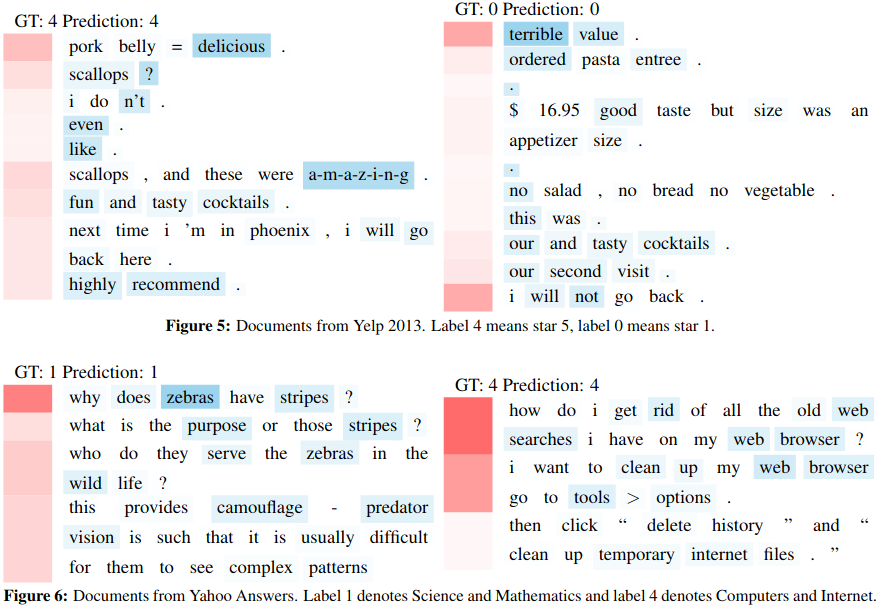

# Supervised machine learning

- Goal is to learn a function $f(\mathbf x)=y$ where $\mathbf
  x\in\mathbb R^p$ is an input/feature vector and $y$ is an
  output/label.
- $\mathbf x=$ text document (email, movie review), binary
  classification $y\in\{1,0\}$ (spam or not, good or bad).
- Last week we studied recurrent neural networks (RNNs), which can be used to
  model the sequential nature of text data.
- This week we will augment the RNNs with an attention mechanism, that
  allows the neural network to prioritize which items in the sequence
  are important for prediction.
  
---

# Intuition/visualization of attention weights

{width=100%}

Yang et al, 2016. Hierarchical Attention Networks for Document
Classification.

---

# A modification of the recurrent neural net from last week

- Last week we used the final hidden state as the features for
  predicting the output.
- In math notation assume we have a sequence of $\tau$ inputs
  $x_1,\dots,x_\tau$.
- The RNN $r$ gives us $r(x_t)=o_t, h_t$, output and hidden state.
- We learned a function $f(h_\tau)$ for predicting the output label
  $y$ of that sequence using the last hidden state.
- Instead we could use an average of the hidden states $h_t$, say
  $\sum_{t=1}^\tau h_t/\tau$.
- What if we could learn the weights in this average, instead of
  giving each item in the sequence a uniform weight of $1/\tau$?
- That is the main idea of the attention mechanism.

---

# Basic idea of attention mechanism

- We learn a nonlinear transform of the hidden state features, $u_t =
  \phi(h_t)$ (single Linear layer followed by nonlinear activation).
- We learn a weight vector $w$ which is used to compute normalized
  importance weights $\alpha_t = \exp(w^T u_t)/\sum_j\exp(w^T u_j)$
  (softmax results in weights that sum to 1).
- We use the normalized importance weights to average the hidden
  states, $\sum_{t=1}^\tau h_t \alpha_t$.
- We can visualize the $\alpha_t$ values to see which words are
  important.
